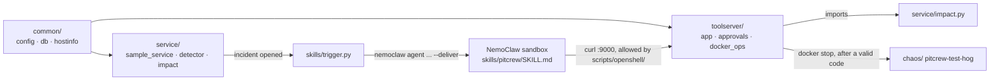

# Pitcrew

A local AI operations agent on a Dell Pro Max with GB10. It detects a slowdown in a local AI service, investigates with tools, calculates which customer work is affected, asks a human before stopping anything, verifies recovery, and reports. All inference is local: Qwen3.6-35B-A3B on vLLM, with the agent on **NemoClaw** (OpenClaw inside an OpenShell sandbox) and Telegram as the channel.

| Doc | What it is |
|---|---|
| [timeline.md](timeline.md) | **The agreed plan and shared contracts.** Wins over every other doc |
| [spec.md](spec.md) | Product spec (what and why) |
| [DEVSPEC.md](DEVSPEC.md) | Engineering detail and the research behind it; see its banner for the differences from the timeline |
| [SANITY_REPORT.md](SANITY_REPORT.md) | Machine check, NemoClaw/OpenShell compatibility, vLLM memory settings |
| [DEPLOY_STARTER_KIT.md](DEPLOY_STARTER_KIT.md) | What's in the offline kit |

## Layout and owners

Each person owns one folder, which keeps merges conflict-free.

| Folder | Owner | Contents |
|---|---|---|
| `common/` | **Shared** (change only after telling everyone) | Settings from `.env`, database schema, machine measurements |
| `service/` | Data Engineer | Sample AI service, queue, detector, impact calculation ([README](service/README.md)) |
| `toolserver/` | Backend | FastAPI tool server on `:9000`, approvals, incidents ([README](toolserver/README.md)) |
| `skills/` | Kunal (AI/ML) | Agent skill `skills/pitcrew/SKILL.md` (installed into the sandbox), trigger ([README](skills/README.md)) |
| `chaos/`, `scripts/` | Hardware Expert | Test program, setup scripts, reset, run, OpenShell policy |
| `tests/` | Everyone | Unit tests per folder + `test_contracts.py`, which checks the folders agree |

## How the folders connect



## Branches

| Branch | Owner | Edits only |
|---|---|---|
| `data-engineer/service` | Data Engineer | `service/` (+ its tests) |
| `backend/toolserver` | Backend | `toolserver/` (+ its tests) |
| `kunal/skills` | Kunal (AI/ML) | `skills/` |
| `hardware/chaos-scripts` | Hardware Expert | `chaos/`, `scripts/` |
| `main` | Everyone, via merge | Integration: what runs on the GB10 |

`common/` and `tests/test_contracts.py` are shared: change them only after telling the team.

## Combining everyone's work

1. Work only in your own folder, on your own branch (in your clone, `~/dev/<name>/GB10-Repo`).
2. Before every push: `scripts/check.sh`. It compiles everything, parses every script, and runs all tests, including the cross-folder contract test. **Push only when it says ALL GREEN.**
3. At each checkpoint, pull into the integration copy `~/GB10-Repo`, run `scripts/check.sh` again, then `scripts/reset.sh`.

## Machine setup (Hardware Expert), in order

```bash
# once, with sudo: Docker access, then log out/in and restart tmux
sudo usermod -aG docker "$USER"
tmux kill-server; tmux new -s setup

scripts/setup/00_python_env.sh          # .venv from the kit's offline wheels, creates .env
scripts/setup/01_load_images.sh         # load kit images, digest checks, GPU-in-Docker check
scripts/setup/02_start_vllm.sh          # Qwen3.6-35B-A3B on :8000 (0.5 memory / 64K context)
scripts/setup/03_check_vllm.sh          # gate: context, chat, tool call must all PASS
sudo scripts/setup/04_lockdown_ports.sh # block 8000 and 9000 from the venue network
scripts/setup/05_install_openshell_nemoclaw.sh   # OpenShell 0.0.116 + NemoClaw 0.0.130 from the kit
scripts/setup/06_onboard.sh             # nemoclaw onboard (Local vLLM + Telegram), policy, skill install
skills/test_trigger.sh                  # agent posts in Telegram with nobody typing
```

## Demo loop

```bash
scripts/run_all.sh        # tool server, sample service, detector in tmux session "pitcrew"
scripts/reset.sh          # back to healthy in < 60 s
chaos/start_hog.sh        # the controlled fault: pitcrew-test-hog grows to ~30 GB
```

Ports: vLLM `:8000` and tool server `:9000` are both blocked from the venue network. Secrets live in `.env` (git-ignored; template in `.env.example`).
