# Pitcrew — Product and Hackathon Demo Specification

**Working description:** A local AI operations agent that finds and helps fix problems on a Dell Pro Max with GB10, while showing which customer work is affected.

**Event:** Dell × NVIDIA AI Hackathon, Boston, October 3, 2026  
**Status:** Team build specification  
**Audience:** All four teammates, including teammates without a technical background

**Judging update from the team's event screen:** Technical execution, usefulness and business value, local-first design, and demo quality are worth **25% each**. The demo-quality description explicitly refers to a **live demo**. Prepare to run the working sequence on the GB10 in front of judges; any recording is a backup or submission asset, not a substitute for a live demonstration.

---

## 1. The idea in plain language

Imagine a company using its GB10 to run an AI service for customers. Customer requests arrive throughout the day and wait in a queue until the service processes them. If a runaway program takes too much memory, the service slows down. A monitoring tool might sound an alarm, but a person still has to work out what caused the problem, decide what is safe to do, and find out which customers are waiting.

**Pitcrew is the on-call helper for that situation.** It notices the problem, investigates the evidence on the machine, explains the likely cause, asks a person before taking a risky action, checks that the action worked, and reports the customer impact.

The business impact portion comes from the Revenue Guardian idea. It connects a technical failure to delayed jobs, affected customers, and an honest estimate of the value of work waiting in the queue. **This is one product with two connected abilities:** technical incident response and business impact reporting.

> **Pitch:** “Pitcrew detects a problem in a local AI service, helps restore it safely, and tells the team exactly which customer work was affected.”

## 2. Who needs it and why

The first customer is a small IT or MLOps team responsible for an AI service running on company-owned hardware. The team may have monitoring alerts, but it still has to inspect processes and logs by hand. Its business colleagues may separately ask, “Which customers are waiting?” or “Do we need to notify anyone?”

Pitcrew gives them a single incident story:

- **Engineering** learns what broke, the evidence, the proposed fix, and whether recovery succeeded.
- **Customer operations** learns which customers and jobs were delayed.
- **Management** gets a short summary of business exposure without reading raw logs.

The value of running the AI investigation on the GB10 is control: detailed operational logs and customer records can be processed by a local model. The required messaging channel will still carry the short alerts and reports sent to it. The team must **not** claim that no information ever leaves the machine.

## 3. What the finished demo should look like

The demo tells **one complete story**, rather than showing many disconnected features.

### Starting state

- A sample AI service is running on the GB10.
- A few fictional customers have jobs in a sample queue.
- The service-health screen shows **Healthy**, and the channel has no open incident.
- Pitcrew is already watching. Nobody has to type a prompt to start the investigation.

### The problem

- A teammate starts a controlled **test program** that gradually uses too much memory.
- The sample service slows, and jobs begin waiting longer than the chosen threshold.
- Pitcrew creates an incident automatically.

### Investigation and response

- Pitcrew checks machine measurements, running programs, service logs, and the job queue.
- It identifies the test program as the likely cause and cites the evidence it used.
- A calculation tool, **not the language model**, counts delayed jobs, affected customers, and waiting time.
- Pitcrew sends a proposed action to the connected channel: stop the specific test program.
- A person approves or denies the request. Nothing risky happens before approval.
- After approval, Pitcrew stops only that test program and checks the service again.
- It reports whether the service recovered and whether delayed jobs are moving again.

### Final result

The channel and optional dashboard show one concise report: what happened, the evidence, the approved action, whether it worked, the affected jobs and customers, and any work still waiting.

```mermaid
flowchart LR
    A[GB10 and service are healthy] --> B[Test program causes a slowdown]
    B --> C[Pitcrew detects the problem]
    C --> D[Agent checks tools and evidence]
    D --> E[Impact tool counts delayed jobs and customers]
    E --> F[Agent requests human approval in the channel]
    F --> G[Approved, limited action]
    G --> H[Agent verifies service recovery]
    H --> I[Incident report and customer impact]
```

## 4. User experience

### Primary user journey: the on-call engineer

1. The engineer receives a message in Slack, Discord, or Telegram: “AI service slowdown detected.”
2. The message includes the time, likely cause, confidence or uncertainty, and links or references to the evidence.
3. It shows a plain-language impact summary: for example, **12 jobs delayed across 3 fictional customers**.
4. Pitcrew proposes one limited action: “Stop test process 4127.” It explains why that action is expected to help.
5. The engineer selects **Approve** or **Deny** through the supported approval flow. If interactive buttons prove difficult, a clear channel command or reply is acceptable, provided the approval can be tied to this exact action.
6. Pitcrew posts a follow-up: action taken or denied, current health, queue status, and any remaining work.

### Secondary user journey: customer operations

1. Customer operations receives a short, role-appropriate impact summary.
2. They can see which fictional customer accounts have delayed jobs and which are most urgent under a simple stated rule, such as longest wait or highest service tier.
3. They receive a suggested communication task. Pitcrew does **not** automatically message real customers in the hackathon demo.

### Example channel messages

> **Incident opened — 14:06**  
> The sample AI service is processing jobs slowly. Memory use rose from 68% to 88% over two minutes. Test process 4127 is the largest new memory user. **12 jobs across 3 fictional customers are delayed.** Pitcrew is checking service logs before recommending an action.

> **Approval requested — 14:07**  
> Proposed action: stop **test process 4127**. Reason: it began using memory shortly before the service slowed. This action affects only the test process. **Approve** or **Deny**.

> **Recovery update — 14:08**  
> Approved action completed. Memory use returned to 70%; the sample service is healthy; 10 of 12 delayed jobs have now processed. **2 jobs still need attention.** Affected customers and the incident record have been updated.

The values above are **illustrative demo data**, not claims about a real customer or measured product performance.

## 5. What the optional dashboard should show

The connected channel is part of the core product. A dashboard is useful for the pitch but comes after the channel flow works.

If built, one page is enough:

| Area | What a viewer sees |
|---|---|
| Current status | Healthy, Investigating, Awaiting approval, Recovering, or Resolved |
| Machine health | Memory trend and service health, with timestamps |
| Incident evidence | The process, log lines, and measurements behind the diagnosis |
| Customer impact | Delayed job count, affected fictional customers, longest wait, and remaining backlog |
| Approval | Exact proposed action and its approval state |
| Timeline | Detection → investigation → approval → action → verification |
| Final report | Cause, action, outcome, and unresolved items |

The dashboard must not expose hidden model reasoning. Show observable tool calls, evidence, and decisions instead.

## 6. Revenue Guardian components retained

| Original Revenue Guardian ability | Pitcrew version |
|---|---|
| Automatic monitoring | Watch GB10 health, service status, and the sample job queue. |
| Incident detection | Open an incident when a defined slowdown or service failure occurs. |
| Cross-source investigation | Connect machine measurements and logs to delayed customer jobs. |
| Business impact | Calculate delayed jobs, affected customers, and waiting time. |
| Customer prioritization | Rank fictional accounts using a transparent rule. |
| Coordinated actions | Give Engineering a proposed fix and Customer Operations an impact summary. |
| Recovery verification | Confirm that the service and queue improve after the action. |
| Incident history | Save the evidence, approval, action, and final state locally. |

This prototype does **not** monitor real payment transactions. It measures customer work delayed by the sample AI service. A future version could connect to payments or another revenue-generating workflow.

## 7. What the numbers mean

Clear definitions keep the demo credible.

| Measure | Meaning | How to calculate it |
|---|---|---|
| Delayed jobs | Jobs waiting longer than the demo threshold | Count queue entries over the threshold |
| Affected customers | Distinct fictional customers with delayed jobs | Count unique customer IDs in those entries |
| Longest wait | Age of the oldest delayed job | Current time minus that job's arrival time |
| Backlog remaining | Jobs still waiting after the fix | Count pending queue entries |
| Estimated value waiting | An optional illustration using sample price per job | Sum sample job prices; label as **estimated billable work waiting** |

**Estimated value waiting is not lost revenue.** Jobs may process later. The team should not claim permanent financial loss, money saved, or minutes of human work saved without evidence.

## 8. How Pitcrew works, without technical jargon

Pitcrew has five parts:

1. **Eyes:** Small monitoring programs read memory use, service status, logs, and the sample job queue.
2. **Alarm:** Simple rules decide when something needs investigation. This runs continuously without repeatedly asking the AI model.
3. **Investigator:** A local AI model examines the alert and chooses from a short list of safe diagnostic tools.
4. **Hands with permission:** A narrowly defined action tool can stop the **specific allowlisted test process** only after a person approves that exact action.
5. **Bookkeeper:** Deterministic code calculates the impact and saves an incident record. The model explains the facts; it does not invent counts or prices.

The model should produce a structured result with: likely cause, supporting evidence, uncertainty, proposed action, customer impact summary, and next check. If the evidence is insufficient, it should say so and request a human review.

## 9. Technical boundaries for this event

The [published Boston event description](https://luma.com/rvinoam5) calls for a business agent on the Dell Pro Max with GB10, local inference with no cloud LLM calls in the runtime path, tool use, and a real channel through OpenClaw. It names NemoClaw, OpenClaw, and OpenShell as the stack. The team should follow any more specific instructions given by organizers at the venue.

The implementation target is:

- **GB10:** Hosts the local model, agent runtime, sample AI service, monitoring, and incident data.
- **NemoClaw / OpenClaw / OpenShell:** Agent and controlled tool environment, as required by the event.
- **Connected channel:** Slack, Discord, or Telegram for alerts, approval, and updates.
- **Small local database:** Stores measurements, jobs, incidents, approvals, and outcomes.
- **Optional web page:** Shows the current state and evidence for the demo.

Use whichever **local model actually runs reliably on the provided machine**. A large model is not a product requirement. Avoid spending the whole build period downloading or tuning one model.

The channel may use the internet; that does not violate the local-inference story. Pitcrew should send only the summary needed for the workflow, not raw logs or sensitive customer records.

## 10. Safe action rules

- The demo uses **synthetic customer records and a deliberately created test program**.
- Pitcrew may inspect measurements, logs, and the sample queue without approval.
- It may not run arbitrary shell commands supplied by the model or by text found in logs.
- Stopping a process requires approval tied to the **exact process and action** shown to the human.
- The action tool checks that the target is the known test process before acting. If the check fails, it refuses.
- A denial ends the action path and produces a status update.
- A successful command is not enough: Pitcrew must check service health and queue movement afterward.
- If Pitcrew cannot verify recovery, it reports the incident as unresolved.

**Prototype limitation:** Because the agent runs on the GB10 itself, it cannot diagnose a complete power failure or total machine shutdown. This demo covers a software slowdown while the machine and agent remain running.

## 11. Division of work for four teammates

| Owner | Owns | Done when |
|---|---|---|
| **AI/ML — Kunal** | Local model, agent instructions, diagnostic tool choices, structured diagnosis, uncertainty handling | One alert causes the agent to call diagnostic tools and propose the correct limited action on the GB10 |
| **Data engineer** | Sample AI service and queue, fictional customers and jobs, controlled slowdown, monitoring rules, impact calculations | One command creates the incident; delayed jobs, customers, and waiting times match known sample data |
| **Backend developer** | Event-to-agent connection, channel messages and approval, action workflow, incident state, optional dashboard | Alert, approval, and recovery update work end to end in the channel |
| **Hardware expert** | GB10 setup, local model runtime, NemoClaw/OpenClaw/OpenShell setup, access, action allowlist, reproducible demo recording | All required parts run on the GB10 and the controlled action affects only the test process |

The four owners should agree early on the shared fields: incident ID, timestamp, service status, process ID, affected job IDs, customer IDs, approval ID, and final outcome. **The integration test is everyone's responsibility.**

## 12. Build priorities

### Must work for submission

1. Local model answers through the intended GB10 runtime.
2. One controlled fault triggers an incident without a manual prompt.
3. Agent uses tools to inspect the cause.
4. Code calculates accurate customer and job impact.
5. Channel shows the incident and receives a human approval or denial.
6. Approved action targets only the test process.
7. Pitcrew verifies the result and posts a final update.
8. The complete flow can be repeated from a clean state.

### Add only if the complete flow already works

- Dashboard with a readable incident timeline.
- Customer priority ranking.
- Searchable incident history.
- A second failure scenario.
- Optional estimated value of delayed work.

### Leave out of this prototype

- Real customer data or live payment systems.
- Automatic contact with real customers.
- Arbitrary production remediation or file deletion.
- Promises of full offline operation while an external channel is connected.
- Unsupported claims of revenue saved or recovery time reduced.

## 13. Acceptance checklist

The team can call the demo complete when it can show all of the following:

- [ ] No user prompt is needed to notice the controlled slowdown.
- [ ] The agent identifies the likely cause using visible measurements and logs.
- [ ] Job and customer counts match the sample queue exactly.
- [ ] The channel receives the incident, approval request, and final update.
- [ ] Denying approval causes **no** corrective action.
- [ ] Approving the specific action affects only the intended test process.
- [ ] Pitcrew checks service and queue recovery after acting.
- [ ] The model's inference runs locally on the GB10 during the demo.
- [ ] The complete sequence works repeatedly with the same expected result.
- [ ] A teammate can run the full sequence live on the GB10 and explain each step in plain language.
- [ ] The pitch clearly distinguishes observed facts from estimates.

## 14. Suggested short pitch
## 14. How this meets the judging criteria

| Criterion | What Pitcrew must prove to the judges |
|---|---|
| **Technical execution — 25%** | A complete event-to-action loop: automatic detection, agent tool use, approval, limited action, and recovery verification. |
| **Usefulness and business value — 25%** | A clear buyer (the team operating a local AI service), a real incident workflow, and measured customer-job impact from the sample queue. |
| **Local-first design — 25%** | The model process and inference run on the GB10, with no cloud LLM call in the agent's runtime path. |
| **Demo quality — 25%** | Show the system working live. Begin healthy, trigger one controlled fault, show investigation and impact, approve the fix, and show recovery. |

The team's event screen shows **Project Submission** and **Hardware Return** as separate upcoming check-ins; **Computer Assignment** is already completed. Submit the project before the listed cutoff and leave enough time to return the provided GB10 during the hardware-return window. Use the current event screen for exact times because those check-ins control the team's submission.

## 15. Suggested short pitch

“Companies are starting to run AI services on machines they own. When one of those services slows down, an engineer gets a technical alert but still has to find the cause and explain the customer impact. Pitcrew runs locally on the Dell GB10. It notices the problem, investigates the machine, calculates which customer jobs are delayed, asks permission for a limited fix, and verifies recovery. The team gets one clear incident report, with the detailed AI investigation processed on its own hardware.”

## 15. The decision to keep the team aligned
## 16. The decision to keep the team aligned

**Build one convincing incident from beginning to end.** The winning artifact for this concept is the working sequence: **problem → evidence → business impact → approval → safe action → verified recovery → report**. Every additional feature should make that sequence easier to understand or more reliable.